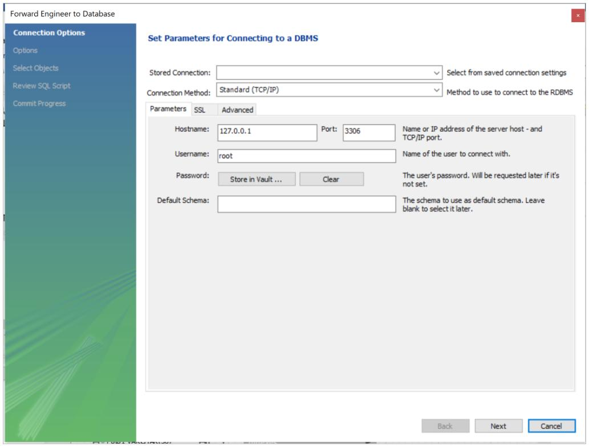
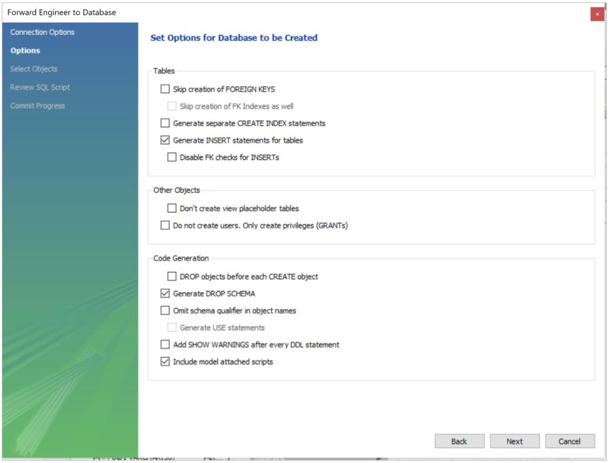
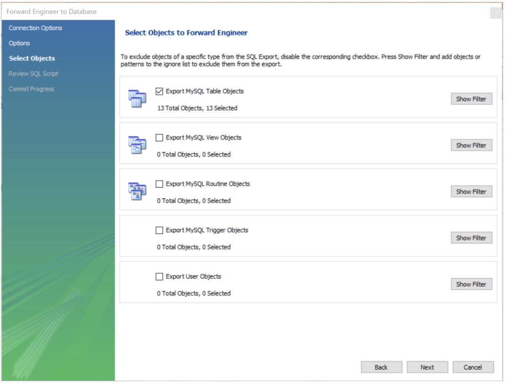
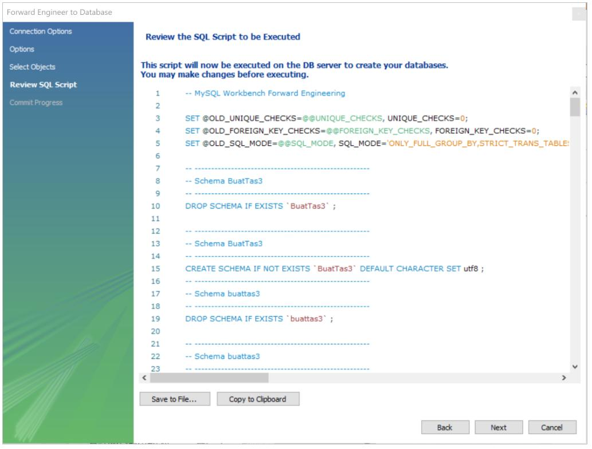
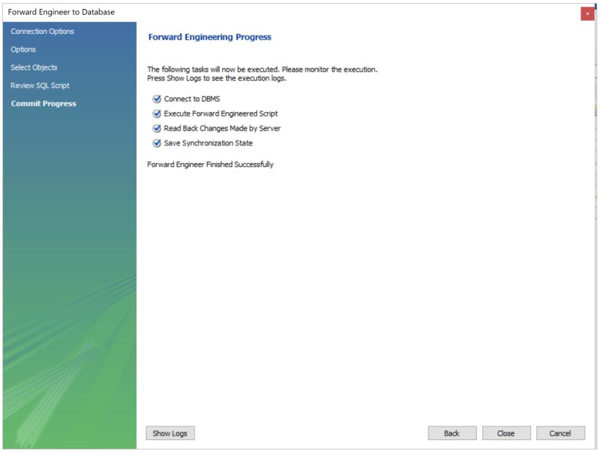
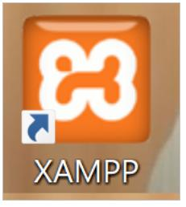
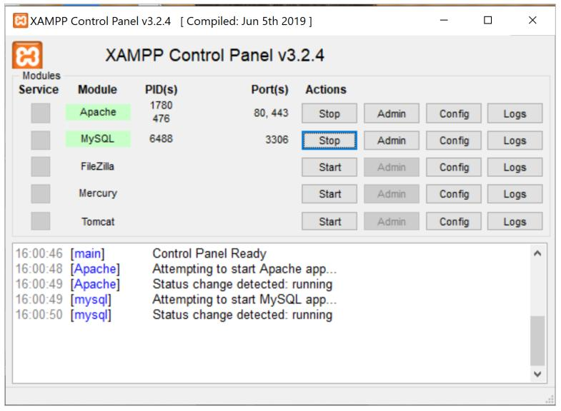
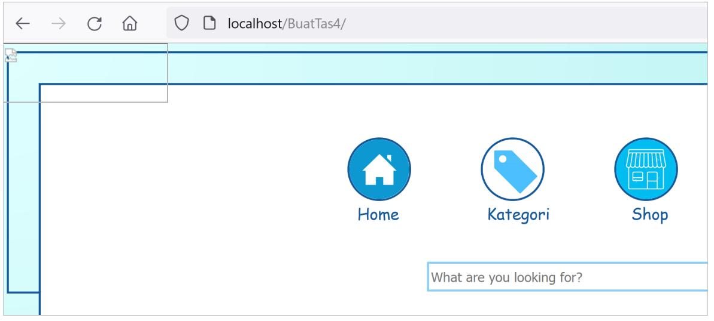

# Sistem Penjualan Tas Pria     

Instalasi **Sistem Penjualan Tas Pria** dibagi menjadi dua, yaitu **Forward Engineer MySQL** dan **Mengakses Program**.
    
## Forward Engineer MySQL
1. Buka MySQL Workbench    
    

2. Pilih Menu: **File** $\rightarrow$ **Open Model** $\rightarrow$ Pilih file `BuatTas3.mwb`     
   
3. Klik **Database** kemudian klik **Forward Engineer**. Tampilan berikut akan muncul:   
 
     
4. Klik **Next** sampai tampilan berikut muncul dan beri tanda **check** ke semua bagian yang diperlukan:

              
5. Klik **Next** lagi dan beri tanda **check** ke semua bagian yang diperlukan.    
    
   
6. Klik **Next** sampai muncul tampilan seperti ini:     
    
   
7. **Forward Engineer** sudah selesai, klik **Close**.   
    

    
   
    
   
    
